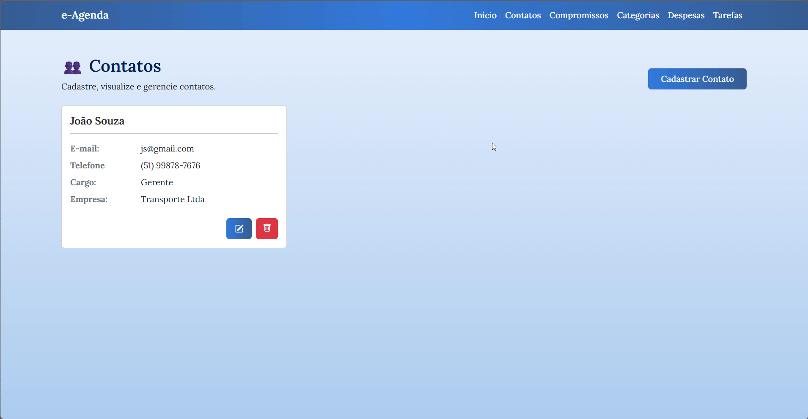
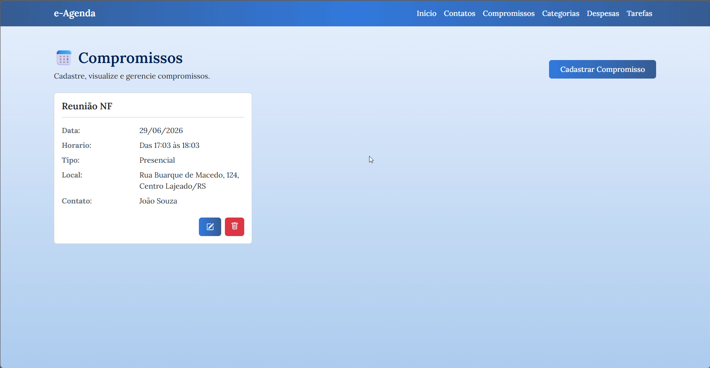
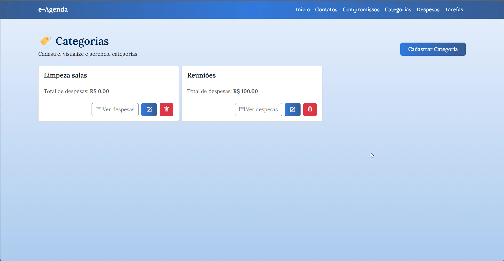
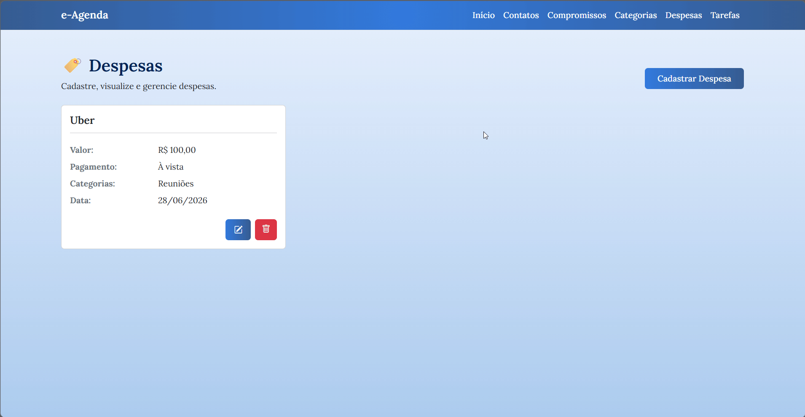
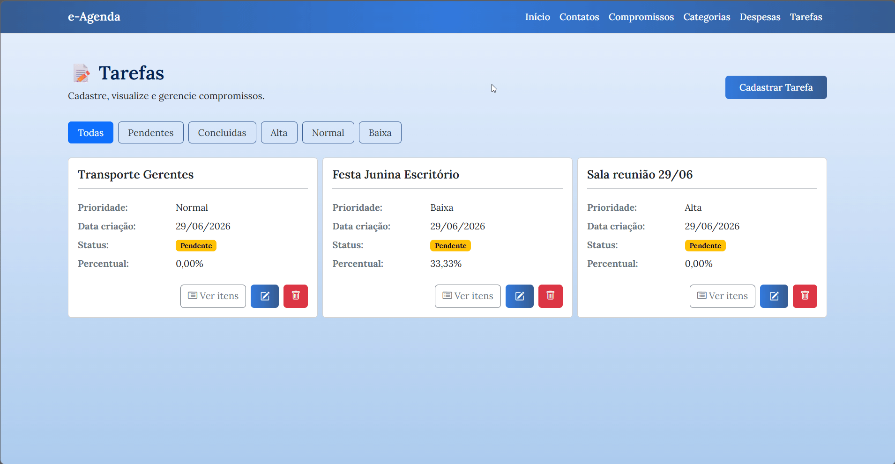
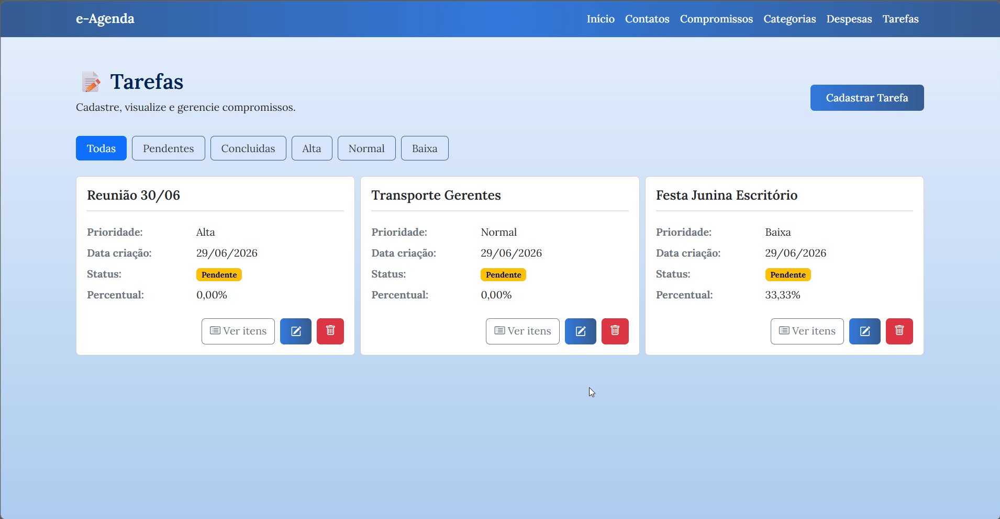

📒 e-Agenda  

- O e-Agenda é um sistema de gerenciamento que reúne em um só lugar funcionalidades essenciais para organização.
Facilitando o controle de contatos, compromissos, categorias, despesas e tarefas com uma interface prática e intuitiva.

- Tudo isso com regras de negócio bem definidas para garantir consistência e confiabilidade dos dados.


<p align="center">

</p>

## Funcionalidades

👥 1. Módulo de Contatos  
<p align="center">

</p>

### Requisitos Funcionais
- O sistema deve permitir a inserção de novos contatos  
- O sistema deve permitir a edição de contatos já cadastrados  
- O sistema deve permitir excluir contatos já cadastrados  
- O sistema deve permitir visualizar contatos cadastrados  

### Regras de Negócio
Campos obrigatórios:  
- Nome (2-100 caracteres)  
- E-mail (formato válido)  
- Telefone (formato validado: (XX) XXXX-XXXX ou (XX) XXXXX-XXXX)  
- Cargo (opcional)  
- Empresa (opcional)  

** O sistema não deve permitir contatos com mesmo e-mail e/ou telefone  
** Não permitir excluir um contato caso tenha compromissos vinculados  

📅 2. Módulo de Compromissos  
<p align="center">

</p>

### Requisitos Funcionais
- O sistema deve permitir a inserção de novos compromissos  
- O sistema deve permitir a edição de compromissos já cadastrados  
- O sistema deve permitir excluir compromissos já cadastrados  
- O sistema deve permitir visualizar compromissos cadastrados  

### Regras de Negócio
Campos obrigatórios:  
- Assunto (2-100 caracteres)  
- Data de Ocorrência  
- Hora de Início  
- Hora de Término  
- Tipo de Compromisso (Remoto ou Presencial)  
- Local (caso presencial)  
- Link (caso remoto)  
- Contato (opcional)  

** O sistema não deve permitir conflito de horários entre compromissos  

🏷️ 3. Módulo de Categorias  
<p align="center">

</p>

### Requisitos Funcionais
- O sistema deve permitir cadastrar novas categorias  
- O sistema deve permitir editar categorias existentes  
- O sistema deve permitir excluir categorias  
- O sistema deve permitir visualizar todas as categorias  
- O sistema deve permitir visualizar todas as despesas pertencentes a uma categoria específica  

### Regras de Negócio
Campos obrigatórios:  
- Título (2-100 caracteres)  
- Despesas (cadastradas posteriormente)  

** O sistema não deve permitir categorias com mesmo título  
** Não deve permitir excluir categorias relacionadas a despesas  

💰 4. Módulo de Despesas  
<p align="center">

</p>

### Requisitos Funcionais
- O sistema deve permitir cadastrar novas despesas  
- O sistema deve permitir editar despesas existentes  
- O sistema deve permitir excluir despesas  
- O sistema deve permitir visualizar todas as despesas  

### Regras de Negócio
Campos obrigatórios:  
- Descrição (2-100 caracteres)  
- Data de Ocorrência (opcional, data de cadastro por padrão)  
- Valor (R$)  
- Forma de Pagamento (À Vista, Crédito ou Débito)  
- Categorias (1 ou mais categorias)  

📝 5. Módulo de Tarefas  
<p align="center">

</p>

### Requisitos Funcionais
- O sistema deve permitir cadastrar novas tarefas  
- O sistema deve permitir editar tarefas existentes  
- O sistema deve permitir excluir tarefas  
- O sistema deve permitir visualizar todas as tarefas, as pendentes e as concluídas  
- O sistema deve permitir visualizar as tarefas agrupadas por prioridade  

### Regras de Negócio
Campos obrigatórios:  
- Título (2-100 caracteres)  
- Prioridade (Baixa, Normal, Alta)  
- Data de Criação  
- Data de Conclusão  
- Status de Conclusão  
- Percentual Concluído  
- Itens da Tarefa (opcionais)  

#### 5.1 Itens de Tarefas  
<p align="center">

</p>

### Requisitos Funcionais
- O sistema deve permitir adicionar ou remover itens em uma determinada tarefa  
- O sistema deve permitir concluir itens de tarefas, alterando o percentual (%) de conclusão da tarefa  

### Regras de Negócio
Campos obrigatórios:  
- Título (2-100 caracteres)  
- Status de Conclusão  
- Tarefa vinculada  

---

## Como utilizar

1. Clone o repositório ou baixe o código fonte.
2. Abra o terminal ou prompt de comando e navegue até a pasta raiz.
3. Utilize o comando abaixo para restaurar as dependências do projeto:

    ```bash
   dotnet restore
   ```
4. Para executar o projeto compilando em tempo real

   ```bash
   dotnet run --project EAgenda.WebApp
   ```

## Requisitos

- .NET 10.0 SDK

## 👩‍💻 Colaboradores

1. Natália Bortoli Vieira - [@nataliavieirab](https://github.com/nataliavieirab)
2. Júlia Hartmann - [@JuliaaHartmann](https://github.com/JuliaaHartmann)
3. Revisado pela [Academia do Programador](https://academiadoprogramador.com.br)